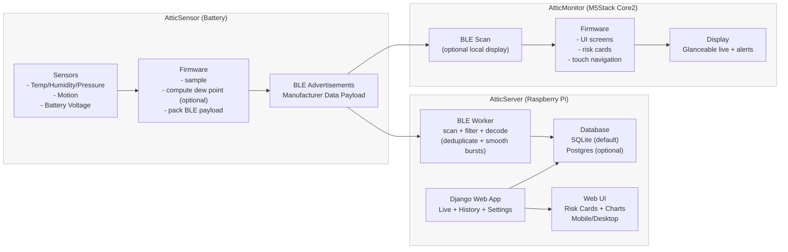

# AtticSystem (AtticMonitor + AtticSensor + AtticServer)

Battery-friendly attic/roof monitoring system for wood-frame homes:
- **AtticSensor**: low-power sensor node(s) broadcasting BLE manufacturer payloads (temp, humidity, pressure, battery, motion)
- **AtticMonitor**: M5Stack Core2 (ESP32) display + touch UI showing live status, risk cards, history, and settings
- **AtticServer**: Django app + BLE ingestion worker for logging, dashboards, and historical views

> Goals: **reliable**, **low-maintenance**, **battery-aware**, and **glanceable** for a small household.

---

## Highlights

- **BLE broadcast ingestion** (no pairing required)
- **Dew point** computation + condensation risk presentation
- **Motion detection** as a “significant event”
- **Battery percent** mapping + icon display
- **Local-first** operation option (Pi host), with internet optional

---

## Repository Layout
```
AtticSystem/
├── AtticSensor/ # Embedded sensor firmware (Feather / Nano / etc)
├── AtticMonitor/ # M5Stack Core2 (ESP32) display firmware
├── AtticServer/ # Django web app + ingestion worker
│ ├── atticguard/ # Django project/app modules
│ ├── ble_worker/ # BLE scan + parse + write DB
│ ├── systemd/ # Service units for Pi deployments
│ └── requirements.txt
├── docs/ # Diagrams, screenshots, design notes
└── .github/workflows/ # CI workflows
```

---

## Architecture

See the diagram in [`docs/architecture.md`](docs/architecture.md) (Mermaid).

Key data flow:
1. Sensor advertises BLE payload every N minutes
2. BLE worker scans, parses payload, writes to SQLite/Postgres
3. Django serves Live/History UI with risk cards + summaries
4. Monitor device optionally displays live + history locally via BLE (or future: via Wi-Fi to server)

---

## Getting Started (Local Dev)

### AtticServer (Django + BLE worker)
```bash
cd AtticServer
python -m venv .venv
source .venv/bin/activate
pip install -r requirements.txt
python manage.py migrate
python manage.py runserver
```

---

## 2) Architecture diagram (Mermaid) — `docs/architecture.md`

```markdown
# AtticSystem Architecture



## 3) Version roadmap (practical, incremental)

Put this in `docs/roadmap.md`:

# AtticSystem Roadmap

## v0.1 (Foundation) ✅
- Sensor BLE payload stable (temp, humidity, pressure, batt, motion, seq)
- BLE worker reliably decodes payload + writes DB
- Django Live view renders latest reading
- Basic systemd service for ble_worker

## v0.2 (Reliability + Debuggability)
- Deduplicate bursty BLE readings (sequence + timestamp window)
- Structured logging (levels + rotating file) for ble_worker
- Health endpoints / status card: “last seen”, “missing data” detection
- Management command to backfill/repair missing computed fields (dew point)

## v0.3 (Risk Model + Glanceable UI)
- Dew point + “roof deck condensation risk” model
- Live view “Risk Card” + “Motion Card”
- Trend indicators (last 1h / 24h change)
- Export CSV button for readings

## v0.4 (History + Charts)
- History page with selectable time ranges (24h / 7d / 30d)
- Simple charts (temp/hum/dewpoint/battery)
- Outlier handling (sensor reboot, partial payloads)

## v0.5 (Deployment Hardening)
- Apache/mod_wsgi + static file pipeline documented
- Install script or Ansible playbook for Pi setup
- DB migration + retention policy (e.g., keep 1y, summarize older)

## v1.0 (Release)
- Documented hardware builds + wiring
- Stable risk thresholds with config
- “First-run experience” checklist
- Tagged release + changelog

## v1.1+ (Future)
- Multi-sensor support (sensor_id + location name)
- Notifications (email/push optional)
- Wi-Fi settings + remote view on LAN

