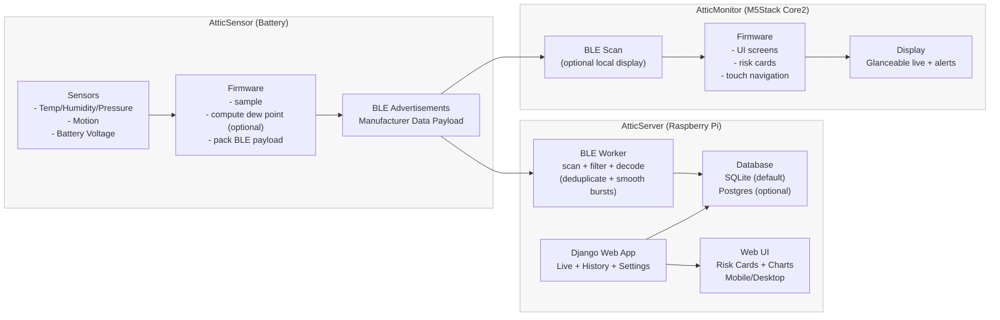

## 2) Architecture diagram (Mermaid) — `docs/architecture.md`

# AtticSystem Architecture

```mermaid
flowchart LR
  subgraph SensorSide["AtticSensor (Battery)"]
    S1["Sensors\n- Temp/Humidity/Pressure\n- Motion\n- Battery Voltage"]
    FW["Firmware\n- sample\n- compute dew point (optional)\n- pack BLE payload"]
    ADV["BLE Advertisements\nManufacturer Data Payload"]
    S1 --> FW --> ADV
  end

  subgraph PiSide["AtticServer (Raspberry Pi)"]
    SCAN["BLE Worker\nscan + filter + decode\n(deduplicate + smooth bursts)"]
    DB["Database\nSQLite (default)\nPostgres (optional)"]
    DJ["Django Web App\nLive + History + Settings"]
    UI["Web UI\nRisk Cards + Charts\nMobile/Desktop"]
    SCAN --> DB
    DJ --> DB
    DJ --> UI
  end

  subgraph MonitorSide["AtticMonitor (M5Stack Core2)"]
    MFW["Firmware\n- UI screens\n- risk cards\n- touch navigation"]
    BLE["BLE Scan\n(optional local display)"]
    DISP["Display\nGlanceable live + alerts"]
    BLE --> MFW --> DISP
  end

  ADV --> SCAN
  ADV --> BLE

  classDef edgeBox fill:#f7f7f7,stroke:#bbb,stroke-width:1px;
  class SensorSide,PiSide,MonitorSide edgeBox;
```
